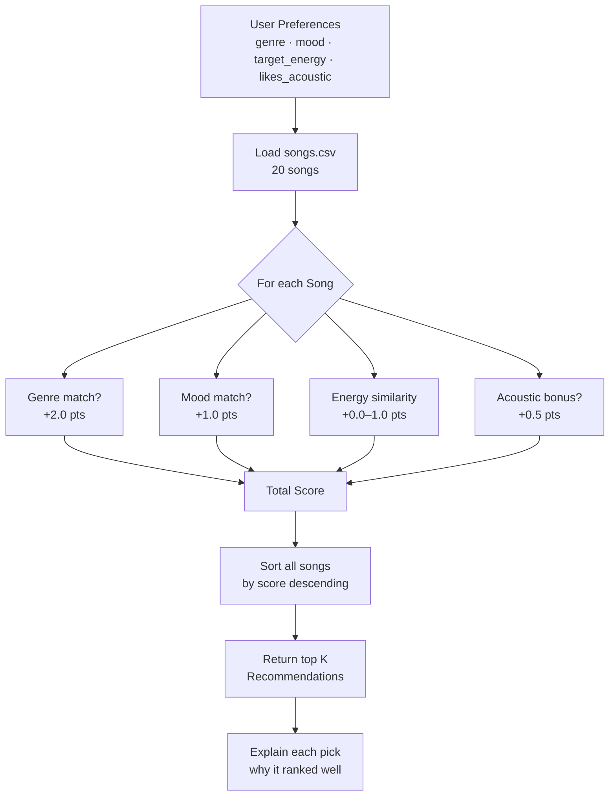
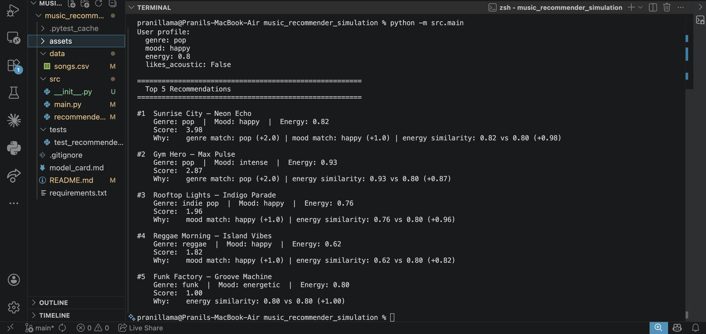
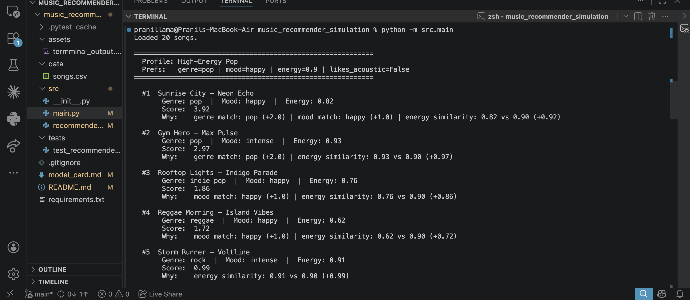
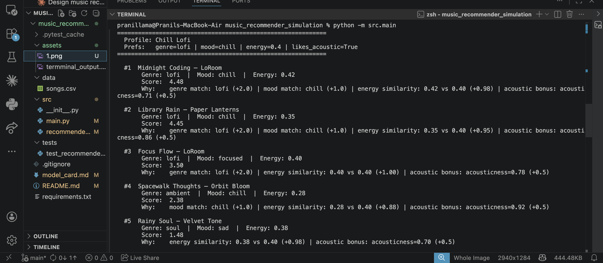
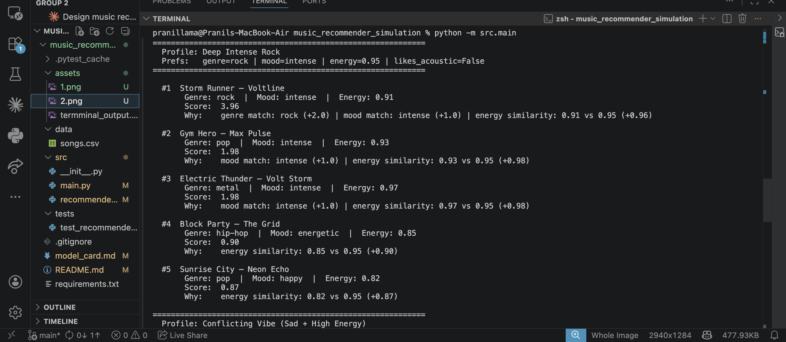
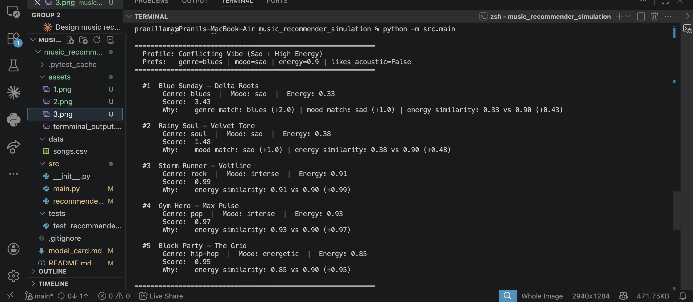
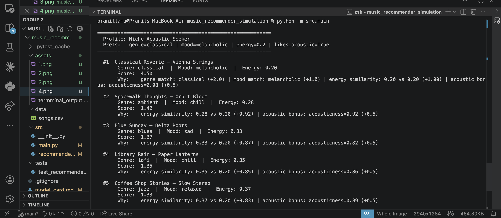

# 🎵 Music Recommender Simulation

## Project Summary

In this project you will build and explain a small music recommender system.

Your goal is to:

- Represent songs and a user "taste profile" as data
- Design a scoring rule that turns that data into recommendations
- Evaluate what your system gets right and wrong
- Reflect on how this mirrors real world AI recommenders

Replace this paragraph with your own summary of what your version does.

---

## How The System Works

Large-scale services (e.g. Spotify, YouTube) usually **generate many candidate** songs or videos, **score or rank** them with models trained on billions of implicit events (plays, skips, dwell time), and often **re-rank** lists for diversity, novelty, and business rules. This project does **not** mimic that pipeline: it is a **small, content-based** simulation. The focus is **interpretability**—every recommendation can be explained from a handful of song attributes and a short, explicit user profile. This version will prioritize **vibe alignment** (mood and genre matches from the profile), **numeric closeness** on energy (and room to extend to valence, danceability, tempo, acousticness when scoring), and **clear explanations** tied to those same fields.

**`Song` object — fields used in the simulation**

- **`id`** — unique catalog id  
- **`title`, `artist`** — labels for display and explanations  
- **`genre`, `mood`** — categorical tags matched to the user profile  
- **`energy`, `tempo_bpm`, `valence`, `danceability`, `acousticness`** — numeric features for distance / similarity in the scorer  

**`UserProfile` object — fields used in the simulation**

- **`favorite_genre`** — compared to each song’s `genre`  
- **`favorite_mood`** — compared to each song’s `mood` (at least as important as genre for separating vibe within the same genre)  
- **`target_energy`** — preferred level; closer `energy` on the song scores better  
- **`likes_acoustic`** — whether to favor higher `acousticness` on tracks  

The `Recommender` scores each `Song` against a `UserProfile`, applies a **ranking rule** (sort by score, take top `k`), and `explain_recommendation` summarizes *why* a song ranked well using these features.

---

### User Taste Profile (Phase 2 Design)

The simulation uses a concrete example profile to test the scoring logic:

```python
user_prefs = {
    "genre":        "lofi",       # favorite genre tag
    "mood":         "chill",      # favorite mood tag
    "target_energy": 0.40,        # preferred energy level (0.0–1.0)
    "likes_acoustic": True,       # bonus for high acousticness
}
```

**Profile critique:** This profile clearly separates *chill lofi* (Library Rain, Focus Flow — low energy, high acousticness) from *intense rock* (Storm Runner — high energy, low acousticness). Because `genre` and `mood` are both explicit, the scorer can distinguish a "chill jazz" track from a "chill lofi" track, giving the genre match extra weight to break ties.

---

### Algorithm Recipe (Phase 2 Design)

Each song receives a score built from four weighted components:

| Component | Points | Logic |
|---|---|---|
| Genre match | **+2.0** | `song.genre == user.genre` |
| Mood match | **+1.0** | `song.mood == user.mood` |
| Energy similarity | **+0.0 – +1.0** | `1.0 - abs(song.energy - user.target_energy)` |
| Acoustic bonus | **+0.5** | if `user.likes_acoustic` and `song.acousticness >= 0.6` |

**Maximum possible score: 4.5**

Songs are then sorted descending by score, and the top `k` are returned.

**Example:** For the profile above, *Library Rain* (lofi, chill, energy=0.35, acousticness=0.86) scores:
- +2.0 genre + +1.0 mood + (1.0 − |0.35 − 0.40|) + +0.5 acoustic = **4.45**

While *Storm Runner* (rock, intense, energy=0.91, acousticness=0.10) scores:
- +0.0 + +0.0 + (1.0 − |0.91 − 0.40|) + +0.0 = **0.49**

---

### Data Flow (Phase 2 Design)



---

### Expected Biases (Phase 2 Design)

- **Genre dominance:** At +2.0 points, a genre match outweighs a perfect mood+acoustic fit (+1.5). A great *chill jazz* track will always lose to a mediocre *chill lofi* track for a lofi-preferring user.
- **Energy range compression:** The energy similarity term is always between 0 and 1, so two songs that both miss the genre tag but have very different energies are barely distinguished.
- **Catalog skew:** 3 of 20 songs are lofi; users who prefer less-represented genres (e.g. metal, blues) will see weaker top matches.
- **Binary acoustic bonus:** `likes_acoustic` is a hard threshold (≥0.6), not a gradient — a song at 0.59 acousticness gets no bonus despite being nearly acoustic.

📍 **Checkpoint:** You have a written concept for real-world vs. simulated recommenders, explicit `Song` / `UserProfile` fields, a weighted scoring recipe, a data-flow diagram, and documented biases.

---

## Getting Started

### Setup

1. Create a virtual environment (optional but recommended):

   ```bash
   python -m venv .venv
   source .venv/bin/activate      # Mac or Linux
   .venv\Scripts\activate         # Windows

2. Install dependencies

```bash
pip install -r requirements.txt
```

3. Run the app:

```bash
python -m src.main
```

### Running Tests

Run the starter tests with:

```bash
pytest
```

You can add more tests in `tests/test_recommender.py`.

---

## Terminal Output



---

## Experiments You Tried

### Profile Outputs (Phase 4)

Five profiles were tested. Run `python -m src.main` to reproduce all results.

**High-Energy Pop** — genre=pop, mood=happy, energy=0.90



**Chill Lofi** — genre=lofi, mood=chill, energy=0.40, likes_acoustic=True



**Deep Intense Rock** — genre=rock, mood=intense, energy=0.95



**Conflicting Vibe (Sad + High Energy)** — genre=blues, mood=sad, energy=0.90 *(adversarial)*



**Niche Acoustic Seeker** — genre=classical, mood=melancholic, energy=0.20, likes_acoustic=True *(adversarial)*



---

### Weight-Shift Experiment (Step 3)

**Change tested:** Genre weight halved (2.0 → 1.0), energy multiplier doubled (×1 → ×2).
**Profile used:** Conflicting Vibe (Sad + High Energy).

| | Original weights | Experimental weights |
|---|---|---|
| #1 | Blue Sunday (blues/sad e=0.33) 3.43 | Blue Sunday (blues/sad e=0.33) 2.86 |
| #2 | Rainy Soul (soul/sad e=0.38) 1.48 | **Storm Runner (rock/intense e=0.91) 1.98** |
| #3 | Storm Runner (rock e=0.91) 0.99 | **Rainy Soul (soul/sad e=0.38) 1.96** |
| #4 | Gym Hero (pop e=0.93) 0.97 | **Gym Hero (pop e=0.93) 1.94** |
| #5 | Block Party (hip-hop e=0.85) 0.95 | **Block Party (hip-hop e=0.85) 1.90** |

**Finding:** Blue Sunday stayed #1 even after halving genre weight because its
genre+mood bonus (2.0 pts) still beat the field. However, #2–5 completely reshuffled
toward high-energy songs once energy was worth 2× as much. This confirms the energy
signal is present in the data but suppressed by the default weights.

---

## Limitations and Risks

Summarize some limitations of your recommender.

Examples:

- It only works on a tiny catalog
- It does not understand lyrics or language
- It might over favor one genre or mood

You will go deeper on this in your model card.

---

## Reflection

[**Model Card**](model_card.md)

Building VibeFinder 1.0 made the mechanics of recommendation systems feel concrete
in a way that reading about them never did. At their core, recommenders are just
scoring machines — every song gets a number, and the highest numbers win. The system
doesn't "know" what good music is; it only knows how to compare attributes. What made
the results feel convincing was the explanation string attached to each rank. Seeing
"genre match: lofi (+2.0) | mood match: chill (+1.0)" next to a result made it feel
personalized, even though the decision was made by adding four numbers together. That
gap between the simplicity of the logic and the apparent intelligence of the output
is exactly how real recommenders work — just at a much larger scale, with weights
learned from data instead of chosen by hand.

The clearest lesson about bias came from the weight experiment. Giving genre +2.0
points seemed reasonable at design time, but testing revealed it could completely
override a user's energy preference. A user who wanted high-energy blues music
received a slow, quiet blues song as their top result — because the genre and mood
match alone outscored everything else. This is a subtle kind of unfairness: the
system appeared to serve the user while actually ignoring part of what they asked
for. In a real product, this kind of weight imbalance could quietly push entire
categories of users toward a narrow slice of the catalog, creating a filter bubble
that feels personalized but is actually driven by the dataset's structure and the
designer's assumptions.


---

## 7. `model_card_template.md`

Combines reflection and model card framing from the Module 3 guidance. :contentReference[oaicite:2]{index=2}  

```markdown
# 🎧 Model Card - Music Recommender Simulation

## 1. Model Name

Give your recommender a name, for example:

> VibeFinder 1.0

---

## 2. Intended Use

- What is this system trying to do
- Who is it for

Example:

> This model suggests 3 to 5 songs from a small catalog based on a user's preferred genre, mood, and energy level. It is for classroom exploration only, not for real users.

---

## 3. How It Works (Short Explanation)

Describe your scoring logic in plain language.

- What features of each song does it consider
- What information about the user does it use
- How does it turn those into a number

Try to avoid code in this section, treat it like an explanation to a non programmer.

---

## 4. Data

Describe your dataset.

- How many songs are in `data/songs.csv`
- Did you add or remove any songs
- What kinds of genres or moods are represented
- Whose taste does this data mostly reflect

---

## 5. Strengths

Where does your recommender work well

You can think about:
- Situations where the top results "felt right"
- Particular user profiles it served well
- Simplicity or transparency benefits

---

## 6. Limitations and Bias

Where does your recommender struggle

Some prompts:
- Does it ignore some genres or moods
- Does it treat all users as if they have the same taste shape
- Is it biased toward high energy or one genre by default
- How could this be unfair if used in a real product

---

## 7. Evaluation

How did you check your system

Examples:
- You tried multiple user profiles and wrote down whether the results matched your expectations
- You compared your simulation to what a real app like Spotify or YouTube tends to recommend
- You wrote tests for your scoring logic

You do not need a numeric metric, but if you used one, explain what it measures.

---

## 8. Future Work

If you had more time, how would you improve this recommender

Examples:

- Add support for multiple users and "group vibe" recommendations
- Balance diversity of songs instead of always picking the closest match
- Use more features, like tempo ranges or lyric themes

---

## 9. Personal Reflection

A few sentences about what you learned:

- What surprised you about how your system behaved
- How did building this change how you think about real music recommenders
- Where do you think human judgment still matters, even if the model seems "smart"

